You may also execute the code presented in this analysis using [DeepNote](https://deepnote.com/workspace/fernandes-0d0f1b15-266f-475a-be59-e6ea9f90c0eb/project/Allegheny-County-Home-Value-Index-4d883e40-705b-4ee7-9326-895000a955f5/notebook/1-DataCleaning-e22221516a40453691eb7fa09e741d87).

# About Matheus C. Fernandes
I am a finishing Ph.D. candidate in Applied Mathematics at Harvard University School of Engineering and Applied Sciences. As an NSF-GRFP fellow, my Ph.D. thesis involves numerically modeling bio-inspired optimized materials and applying generative parametric machine learning algorithms to control soft robotic actuators and classify objects based on embedded sensor data. You may watch a TED-style talk on my research work on [Youtube](https://youtu.be/u16FjNGMoEs).

I have earned a Masters of Science (S.M.) in Computational Science and Engineering in 2020 from Harvard and earned a terminal Masters of Engineering (M.Eng.) in Engineering Sciences with a concentration in Mechanical Engineering and Material Science in 2015 also from Harvard. My M.Eng. thesis was on modeling 'Mechanics of Subglacial Hydrology under Supraglacial Lakes and Ice Stream Shear Margins'. 

To learn more about my research interests and find a list of publications, please visit my website at [fer.me](https://fer.me). You may also find my full CV and Resume [here](./about.html).

# About Allegheny County

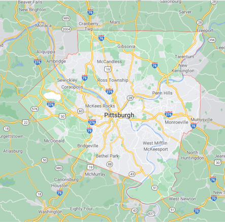

Located in the southwest of the U.S. state of Pennsylvania. As of 2019, the population was 1,216,045, making it the state's second-most populous county, following Philadelphia County. The county seat is Pittsburgh. Allegheny County is included in the Pittsburgh, PA Metropolitan Statistical Area, and in the Pittsburgh Designated Market Area.

# Project Goal
Develop a monthly “Allegheny County Home Value Index” (HVI) to understand key features of the market. Create a model to gain insights for investment opportunities. As per prompt description which can be found [here](./prompt.html).

# About the Dataset
The dataset can be obtained from the [Western PA Regional Data Center](https://data.wprdc.org/dataset/property-assessments). Each of the features contained in the dataset is explained in [this document](./assets/property-assessment-data-dictionaryrev.pdf).

# 1. Data Cleaning
This portion of the project can be found on [Github](https://github.com/matheuscfernandes/fidelity-interview/blob/main/1-DataCleaning.ipynb) and [Deepnote](https://deepnote.com/workspace/fernandes-0d0f1b15-266f-475a-be59-e6ea9f90c0eb/project/Allegheny-County-Home-Value-Index-4d883e40-705b-4ee7-9326-895000a955f5/notebook/1-DataCleaning-e22221516a40453691eb7fa09e741d87)

In order to ensure adequate and properly labeled data, I performed a strict data cleaning procedure. I removed data that is missing important information such as 

- Sale price
- Sale date
- Sale price is 0 or unreasonably low (<$1000)

For other less important features, I attempted to not lose the information contained in columns not missing data, but at the same time not introduce noise into the data. To achieve this, I employed a few different strategies, depending on the date, namely:

- Created a new category for unknown, zeros, or boolean
- Replaced missing data with mean from other data for continuous variables
- Imputed information from different columns where it made sense, namely, previous sale date and previous sale date 2

Also to ensure computational efficiency, I converted 64bit integers to 32- and 8-bit integers. This reduced the data in memory from ~380MB to ~120MB without losing any information.

In an attempt at feature engineering, I tried converting street addresses into latitude and longitude geolocations, but because the free API was extremely slow, I decided to perform this on the zip code level instead of the property level. I then encoded the zipcode into latitude and longitudes. By comparing the granularity between these two I made the decision to pursue only keeping the zip code level.

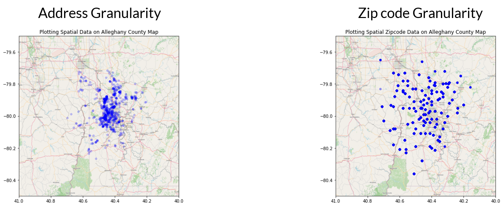

Lastly, to ensure proper weighting between features, I standardized the dataset.

# 2. Exploratory Data Analysis
This portion of the project can be found on [Github](https://github.com/matheuscfernandes/fidelity-interview/blob/main/2-ExploratoryDataAnalysis.ipynb) and [Deepnote](https://deepnote.com/workspace/fernandes-0d0f1b15-266f-475a-be59-e6ea9f90c0eb/project/Allegheny-County-Home-Value-Index-4d883e40-705b-4ee7-9326-895000a955f5/notebook/2-ExploratoryDataAnalysis-1f3e6d6774db446fa849362dfdb27414)

I performed Exploratory Data Analysis on the data before considering any models. This allows me to understand the effects of each of the variables on the target data of interest, namely, each property’s sale price.

The first variable I explore is the sale date. To understand how the price varies with time, I plot the price in a semilog y-axis as a function of time.  

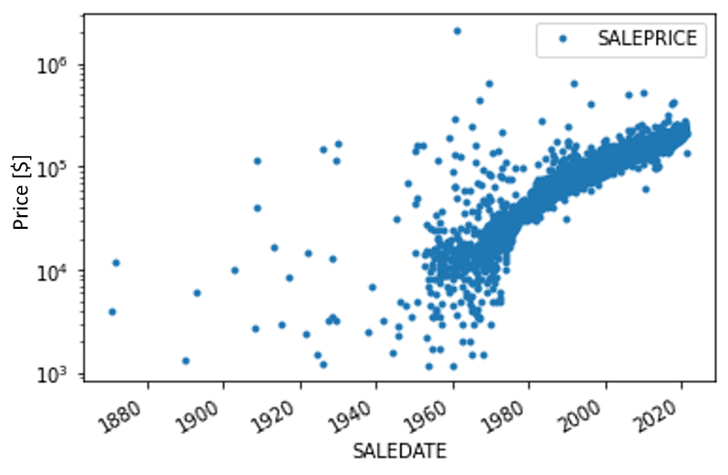

The first question I attempt in answering is wether this time series is martingale. For it to be a martingale, the random variable must follow the following conditional expectation constraints:

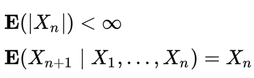

By fitting an exponential line, we see that the expectation follows an exponential growth, namely, $y=ae^{bx}$

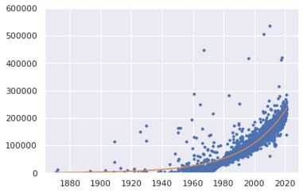

The next thing to look at is the correlation between variables. To do that I plot the correlation matrix. This provides information on the correlation of variables. No correlation does not mean the data does not contain useful information. But high correlation between variables means potential redundancy between those variables.

Next, I do a deeper dive into the data to understand wow does each variable depends on the other. This can help me look for trends in the data and see how property sale price depends on each feature.

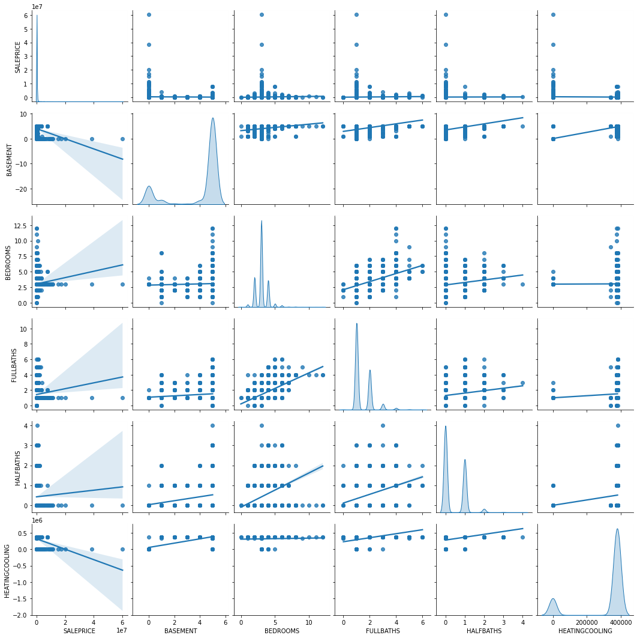

### How do house properties impact pricing?

From the plot below, I see that the property’s features can impact pricing. Most of it is concentrated into properties that meet certain criteria -- likely due to proximity to city centers. Bigger is not necessarily a higher price.

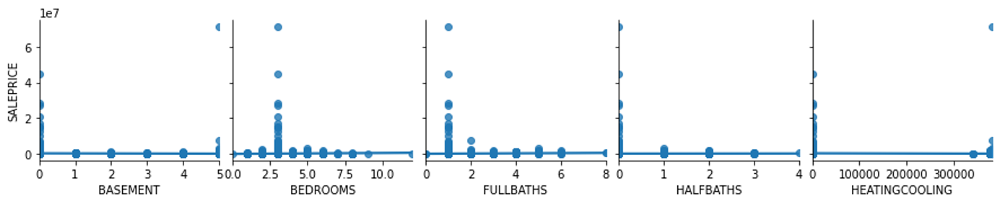

### How does location impact pricing?

From the plot below, I see that location can impact property valuations. Mostly concentrated at the center, which is the downtown area of Pittsburgh.

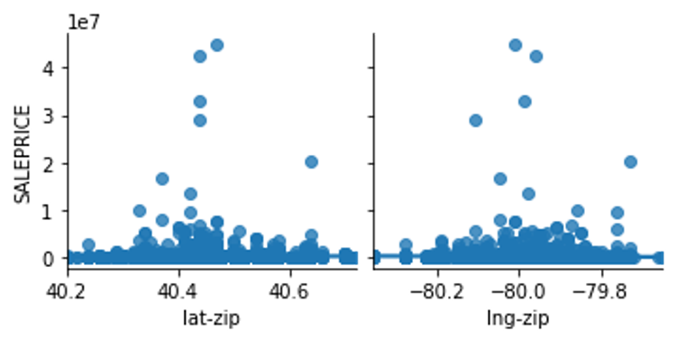

### What is the distribution of the data across different locations?

Most of the data in the dataset are located in a few zipcodes. This could lead to problems in the prediction as most of the information we have is concentrated in certain locations.

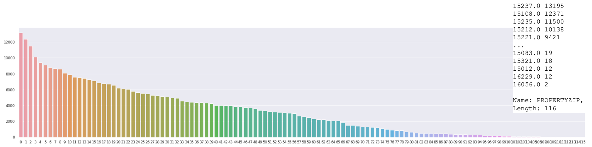

### How do the assessments impact pricing?

From the plot below, I see that there is a positive correlation between the property sale price and fair market assessment. This is expected since the goal of the assessment is to predict the value of a property. Conversely, we also see that the assessment is, in my opinion, not doing a good enough job of predicting the sale price. My goal here is to do a better job predicting the sale price than the official assessment. 😄

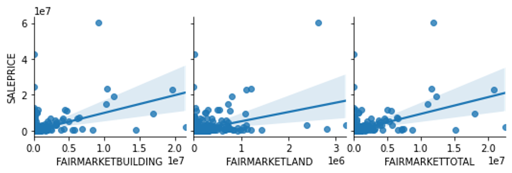

# 3. Model Exploration
This portion of the project can be found on [Github](https://github.com/matheuscfernandes/fidelity-interview/blob/main/3-ModelExploration.ipynb) and [Deepnote](https://deepnote.com/workspace/fernandes-0d0f1b15-266f-475a-be59-e6ea9f90c0eb/project/Allegheny-County-Home-Value-Index-4d883e40-705b-4ee7-9326-895000a955f5/notebook/3-ModelExploration-5dbdd3a195e24f5a9b2286b25eac84f7)

**Model Goal:** Predict valuation of existing homes for a variable sale date.  

**Target variable:** Sale Price

**Input variables:** Sale date and important features that provide information on the valuation of a property at a certain date

**Model Assumptions:**

- No information on the buyer’s side (demand)
- No listing prices or spread of ask/bid
- No information on interest rates
- No demographic information
- No information on the economy
- No refined information on the location
- Based on assessments only from 2021 (dataset)
- Discrete daily sampling 

**Seek these regression model characteristics:**

- Deal with sparse data
- Good for dealing with categorical and numerical data
- Efficient at training (limited computational resources on my end)
- Scalable to potentially adding more data in the future

## Model Performances

|     Model                                  |     Train Score    |     Test Score    |
|--------------------------------------------|:------------------:|:-----------------:|
|     Linear Model: LassoCV                  |        0.573       |        0.495      |
|     Support Vector Machine (SD)            |        0.201       |        0.007      |
|     Ensemble: Random Forest                |        0.900       |        0.523      |
|     Ensemble: Bagging                      |        0.930       |        0.588      |
|     Ensemble: Adaptive Boosting (SD)       |        0.829       |        0.380      |
|     Ensemble: Extreme Gradient Boosting    |        0.814       |        0.767      |

*Scores are measured using R2 Score: 1-(sum of square residuals/total sum of squares)

SD = sampled dataset

### About XGBoost
This is a decision-tree-based ensemble model that Uses a gradient boosting framework to convert weak to strong learner through sequential learning
Gradient descent algorithm. This method is great for small-to-medium structured/tabular data and is boosting optimized for software and hardware parallelization.

## Another Level Feature Selection
### Feature Importance
This importance measure is based on the Gini importance of decision trees defined by:

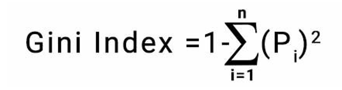

Looking at each of the feature’s importance measures, we can rank them from highest to lowest and plot them as seen below. The higher the importance the more crucial the feature is for the prediction.

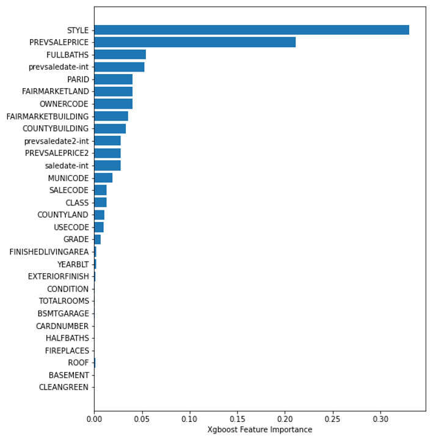

### Permutation Importance
For the permutation importance, the algorithm computes a score for the model and then, for each feature, shuffles the column and computes a score for the corrupted dataset. Then, based on how much it impacts the accuracy of the prediction (in the form of error) it provides a measure of how important a feature is. The higher the importance the more crucial a particular feature is for the model.

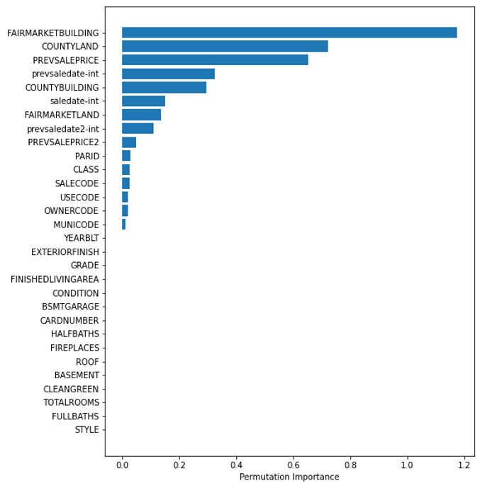

## Hyper Parameter Tuning
Here I begin focussing my efforts on the XGBoost model since it provided the best test score.

For computational efficiency, I only tuned 1 parameter, namely the number of estimators in the XGBoost model, and uses cross-validation with a 4-way split to determine the score. In the plot below I see that a bias-variance balance is obtained at n=110, with underfitting before and overfitting after. Furthermore, when looking at the average training time I see that as n increases computational time increases.

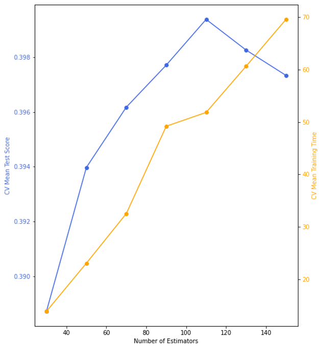

# 4. Computing HVI
This portion of the project can be found on [Github](https://github.com/matheuscfernandes/fidelity-interview/blob/main/4-ComputingHVI.ipynb) and [Deepnote](https://deepnote.com/workspace/fernandes-0d0f1b15-266f-475a-be59-e6ea9f90c0eb/project/Allegheny-County-Home-Value-Index-4d883e40-705b-4ee7-9326-895000a955f5/notebook/4-ComputingHVI-c04b3e2480664138b5f8da717146fbf2)

The Home Value Index measure presented here is based on the [Zillow HVI methodology](https://www.zillow.com/research/zhvi-methodology-2019-deep-26226/).

## What does it mean? (based on Zillow’s definition)

It provides insight into typical home values, the housing market and provides information on the appreciation over time.

## Method
To compute the HIV I follow the procedure outlined below. I begin by using the XGBoost model predictions for all existing properties $z_i$, based on the year built, for each month $t$. Then I use this information to compute the property $i$ appreciation $a$ at time $t$, namely, $a_{i,t}$. Respectively, I also compute the weight of the property based on the previous time $w_{i,t-1}$. Thus summing overall properties $i$ for a time $t$, I am able to obtain the market appreciation at a given time $A_t$.

Once I have $A_t$ for all $t$, I can work backward by computing the index $I_{t-1}$ through adjusting the previous value $I_t$ by the appreciation. The first index, namely $I_t$ where $t$ is today, I take the average market value for the current time and initialize that as the index. Note, this could have been chosen differently and would only scale the value of the graph uniformly.

Lastly, since there can be some noise and high variation month over month, I  decided to follow the Zillow recommendation to average over a period of two years, namely 24 months. 

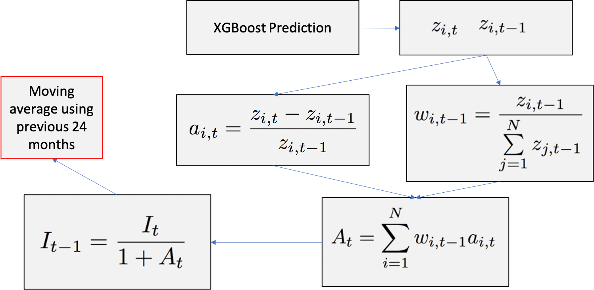

## Results

The plot below provides us with a monthly time series of the predicted home value index. We can extract a few key economic features from this graph that validate the accuracy of the model:

- Late 1930s housing boom after the great depression
- 1990 housing crisis
- Dot-com bubble
- 2007 housing bubble
- 2007 housing recovery
- 2020 pandemic

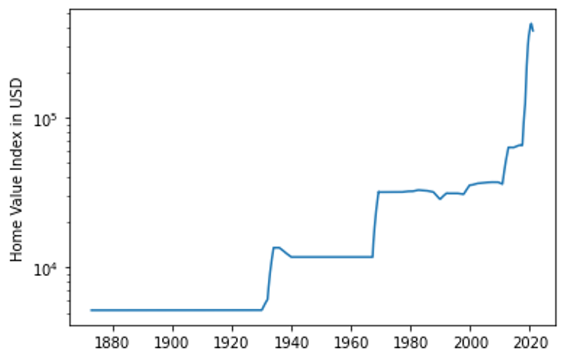

# Conclusions and Recommendations

Based on the results obtained from the model alone under the stated assumptions, I do not suggest investing in the housing stock in Allegheny county at the moment. If the customer currently holds property holdings at the moment, I would recommend liquidating the assets. Although Allegheny County real estate has historically been a good long-term investment, based on recent trends it seems not to be a good time to invest. Furthermore, uncertainties arising from assumptions made could lead to inaccurate predictions when extrapolating beyond the date existing in the data.

# Model Extension and Improvement Suggestions

To improve the model, I would like to create a monthly HVI for each separate Zip code and create a county-level index based on the zip code level. Implement a better geolocation scheme to refine location information as well as account for economic data such as interest rates into the model. Finally, I would like to include additional sale data and historical assessment data from multiple listing services (MLS).

# Slide Deck

<iframe src="https://drive.google.com/file/d/1YcYaDYHPPlgktoVVEGsUfsRZKkI2_JGF/preview" width="100%" height="700"></iframe>
